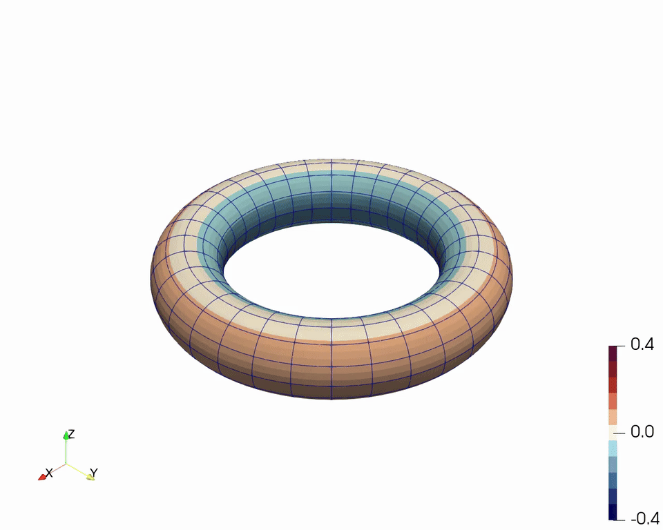
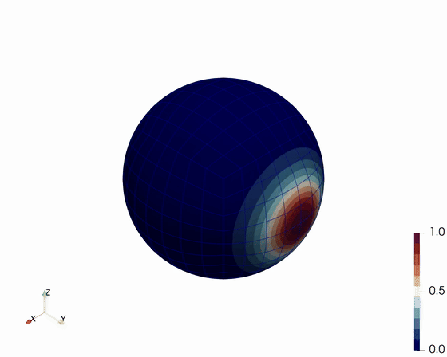

# TrixiManifolds.jl
[](https://opensource.org/licenses/MIT)

**Note: This repository is still in its alpha stage and anything might change at any time and without warning.**

`TrixiManifolds.jl` provides extensions for solving PDEs on curved manifolds using the [Trixi.jl](https://github.com/trixi-framework/Trixi.jl) ecosystem.

## Included features
<p align="center">
  
  
</p>

- Torus manifold support: custom periodic torus mesh construction and covariant metric-term
  initialization, demonstrated in `examples/elixir_wave_torus.jl`, using state
  `(p, u^1, u^2)` and a mixed conservative/nonconservative linear form.
- Sphere support included from [TrixiAtmo.jl](https://github.com/trixi-framework/TrixiAtmo.jl): covariant advection on a cubed sphere demonstrated in `examples/elixir_advection_cubed_sphere.jl`.
- Generic covariant linear system model `CovariantLinearSystem2D`, supporting
  conservative `A` terms and optional nonconservative `B` terms, used by the
  included torus and sphere examples.

## Installation
First, make sure you have [Julia](https://julialang.org/downloads/) installed (the code was tested with Julia v1.12). Then, assuming you're on Linux or MacOS, run the following commands:

```bash
git clone git@github.com:tristanmontoya/TrixiManifolds.jl.git
cd TrixiManifolds.jl
mkdir run
cd run
julia --project=. -e 'using Pkg; Pkg.develop(PackageSpec(path=".."))'
julia --project=. -e 'using Pkg; Pkg.add(["Trixi", "TrixiAtmo", "OrdinaryDiffEq", "Trixi2Vtk"])'
```

## Basic usage
From the `run` directory, start Julia with `julia --project=.` and run one of the manifold examples:

```julia
julia> using Trixi
julia> trixi_include("../examples/elixir_wave_torus.jl")
```

or

```julia
julia> trixi_include("../examples/elixir_advection_cubed_sphere.jl")
```

`elixir_wave_torus.jl` runs to `T = 10` and `elixir_advection_cubed_sphere.jl` runs to
`T = 4`; both use output interval `0.02`. They already convert output to `.vtu` at the end.
If needed, you can run:

```julia
julia> using Trixi2Vtk
julia> trixi2vtk("../examples/output/wave_torus/solution_*.h5",
                 output_directory="../examples/output/wave_torus")
julia> trixi2vtk("../examples/output/advection_cubed_sphere/solution_*.h5",
                 output_directory="../examples/output/advection_cubed_sphere")
```

For `examples/elixir_wave_torus.jl`, output variables are stored with generic names:
`u1 -> p`, `u2 -> u^1`, `u3 -> u^2`.

## Animations
Use the script in `scripts/` to render animations directly from terminal. It auto-reexecutes via `pvbatch` when run with normal Python.

Prerequisites:
- Python 3
- ParaView installed with `pvbatch` available (either on `PATH` or via `PVBATCH=/path/to/pvbatch`)
- `ffmpeg` on `PATH` for movie output (`.mp4`, `.avi`, etc.); PNG plot output does not require `ffmpeg`
- VTU files in `examples/output/` (for example from `trixi2vtk("examples/output/solution_*.h5", output_directory="examples/output/")`)

### Generate `wave_torus` GIF

Run the wave example to produce `examples/output/wave_torus/solution_*.vtu`:

```julia
julia> using Trixi
julia> trixi_include("../examples/elixir_wave_torus.jl")
```

Render an `.mp4` with a colour scale centred at zero:

```bash
python scripts/render_paraview_animation.py \
  --input "examples/output/wave_torus/solution_*.vtu" \
  --output examples/output/wave_torus/wave_torus_plot.mp4 \
  --field u1 \
  --color-min -0.4 \
  --color-max 0.4
```

Convert the `.mp4` to `.gif`:

```bash
ffmpeg -y -i examples/output/wave_torus/wave_torus_plot.mp4 \
  -vf "fps=20,scale=960:-1:flags=lanczos,palettegen" /tmp/wave_torus_palette.png
ffmpeg -y -i examples/output/wave_torus/wave_torus_plot.mp4 \
  -i /tmp/wave_torus_palette.png \
  -lavfi "fps=20,scale=960:-1:flags=lanczos[x];[x][1:v]paletteuse" \
  examples/output/wave_torus/wave_torus_plot.gif
```

### Other example animations

```bash
python scripts/render_paraview_animation.py \
  --input "examples/output/advection_cubed_sphere/solution_*.vtu" \
  --output examples/output/advection_cubed_sphere/animation.mp4 \
  --field u1 \
  --camera isometric
```

To output `.png` files, simply replace `animation.mp4` with a pattern like `plot_*.png`, where `*` will be replaced with the frame number.

### Example animations
- Torus wave (`T = 10`, 20 fps): [examples/output/wave_torus/wave_torus_plot.mp4](examples/output/wave_torus/wave_torus_plot.mp4)
- Cubed sphere (`T = 4`, 20 fps): [examples/output/sphere_plot_full_t4_20fps.mp4](examples/output/sphere_plot_full_t4_20fps.mp4)


## License
This code is released under the [MIT license](https://opensource.org/license/mit).
